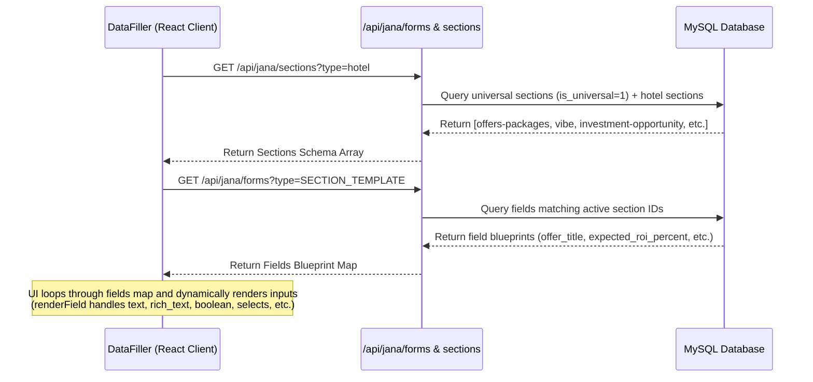

# Architectural Blueprint: Dynamic Form Sections & Marketplace Collectors

This document explains the end-to-end lifecycle of how universal marketplace sections (Investment, Auction, Offers, Sponsorship) dynamically render in the **Unified Studio** and feed into the **Public Site Collectors** without manual database migrations.

---

## 1. The Core Data Model: Schema-Driven JSON (`custom_data`)

Instead of creating new SQL tables for every new feature, the system uses a **Hybrid SQL + JSON Document Store** model.

```
                  ┌──────────────────────────────────────────────┐
                  │              businesses Table                │
                  ├─────────────┬─────────────┬──────────────────┤
                  │     id      │    name     │   custom_data    │
                  ├─────────────┼─────────────┼──────────────────┤
                  │     123     │ Hotel Siwa  │  { JSON Document}│
                  └─────────────┴─────────────┴────────┬─────────┘
                                                       │
                                      ┌────────────────┴────────────────┐
                                      ▼                                 ▼
                    { "offers-packages": {            { "investment-opportunity": {
                         "offer_title": "Summer",          "opportunity_title": "Hotel Round A",
                         "offer_price": "120"              "expected_roi_percent": "18"
                      }                                 }
```

* **SQL Side**: Holds core metadata (e.g., `id`, `name`, `slug`, `type_id`, `status`).
* **JSON Document Side (`custom_data`)**: Stores all section-specific data entered by the vendor. Each section's data is keyed by its unique **Section ID** (e.g. `offers-packages`).

---

## 2. Phase 1: Dynamic Form Rendering in Unified Studio (Stage 2)

When a vendor opens the **Unified Studio (Stage 2 - Data Filler)** for a selected business:



### Form Input Key Binding
In the UI, every input element binds its value using a **double-underscore compound key**:
```typescript
const key = `${sectionId}__${fieldName}`; // e.g., "offers-packages__offer_title"
```
When saved:
1. The flat `formData` object is grouped by its prefix (`sectionId`).
2. The prefix is stripped, reconstructing a clean JSON block for that section.
3. A `PUT` request is sent to `/api/jana/businesses/[id]` containing the updated `custom_data` document.

---

## 3. Phase 2: High-Performance Public Site Collection (Discovery APIs)

To gather all offers, investments, or auctions across the entire platform, we do not need to query each business's page sequentially. We execute a high-performance **JSON Query** directly at the database level using MySQL's native `JSON_EXTRACT` and `JSON_UNQUOTE` functions.

### Example: Offers Discovery SQL
```sql
SELECT 
  b.id, 
  b.name AS business_name, 
  b.slug,
  JSON_UNQUOTE(JSON_EXTRACT(b.custom_data, '$."business_info".business_logo')) AS logo,
  JSON_EXTRACT(b.custom_data, '$."offers-packages"') AS offer_data
FROM businesses b
WHERE b.status = 'active'
  AND JSON_EXTRACT(b.custom_data, '$."offers-packages"') IS NOT NULL;
```

### Why this is highly performant:
1. **Single Query**: Returns all active listings in a single database round-trip.
2. **Dynamic Filtering**: The discovery API iterates through the returned rows, checks if `visibility_on_main_site` is true, extracts all 3 slots (Slot 1, Slot 2, Slot 3), and merges database-driven packages (`experience_packages` table).
3. **No Redundant Tables**: Everything updates in real-time. If a vendor updates their discount rate in the Studio, the public `/discounts` collector reflects it immediately on the next page refresh.

---

## 4. Summary of Data Lifecycles

| Section | Studio Section ID | SQL Storage Column | Discovery API | Main Website Path |
|---|---|---|---|---|
| **Investment** | `investment-opportunity` | `businesses.custom_data` | `/api/discovery/investments` | `/investment-opportunities` |
| **Sponsorship** | `sponsorship` | `businesses.custom_data` | `/api/discovery/sponsorships` | `/investment-opportunities` (Tab) |
| **Auctions** | `auction` | `businesses.custom_data` | `/api/discovery/auctions` | `/auctions` |
| **Offers** | `offers-packages` | `businesses.custom_data` + `experience_packages` table | `/api/discovery/offers` | `/offers` & `/packages` |
| **Discounts** | `discounts-promotions` | `businesses.custom_data` | `/api/discovery/discounts` | `/discounts` |
